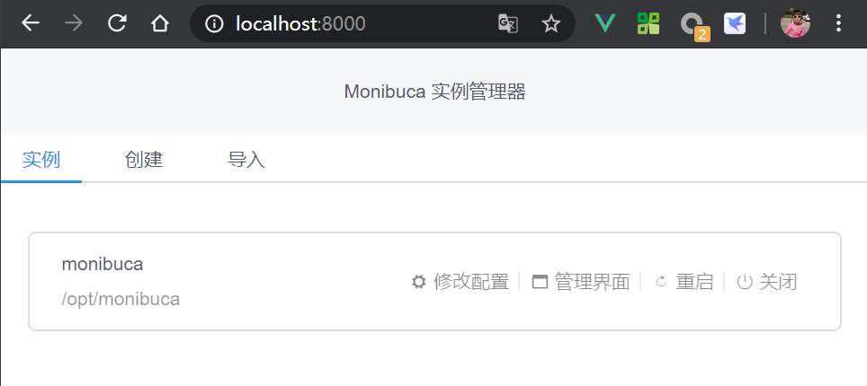
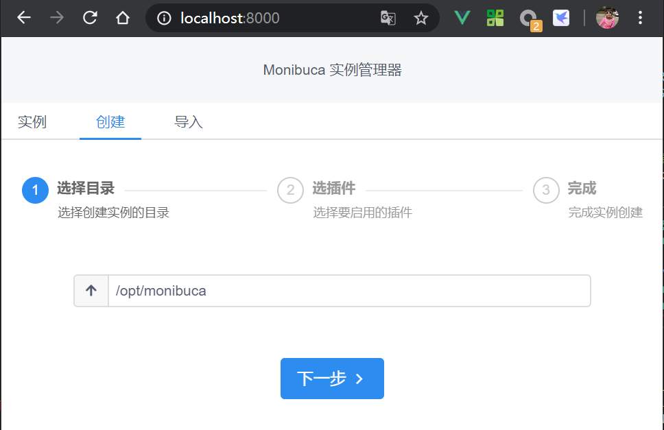
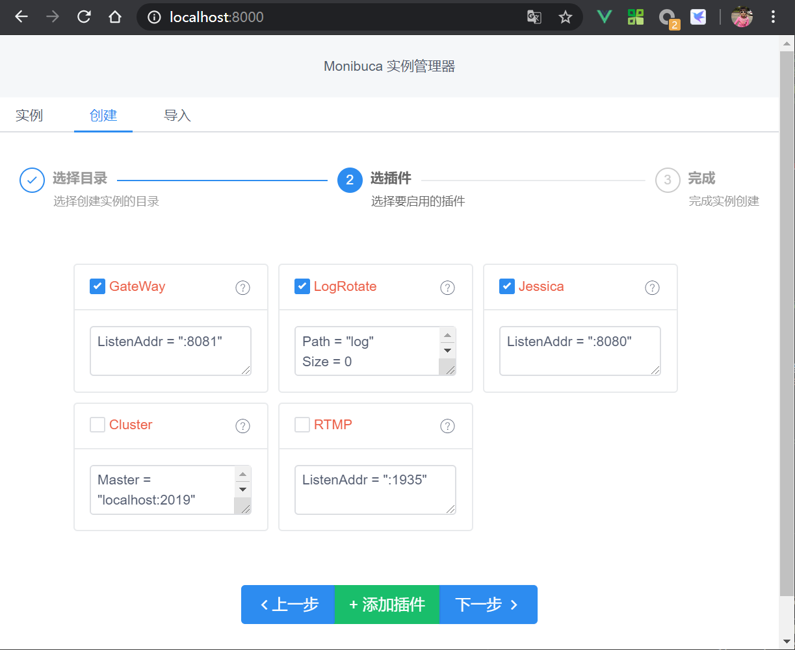
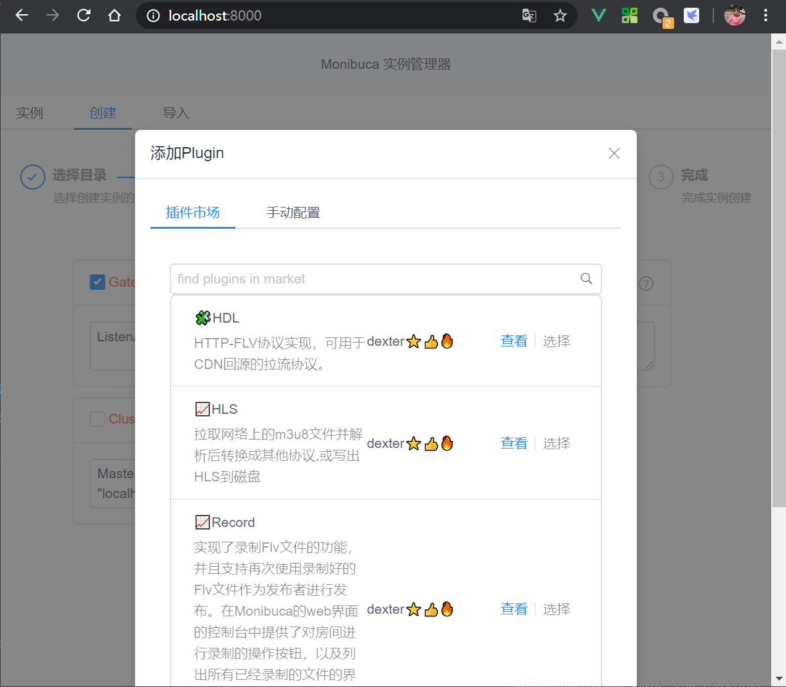
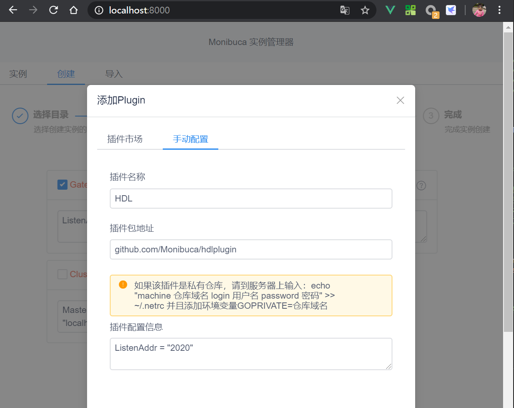
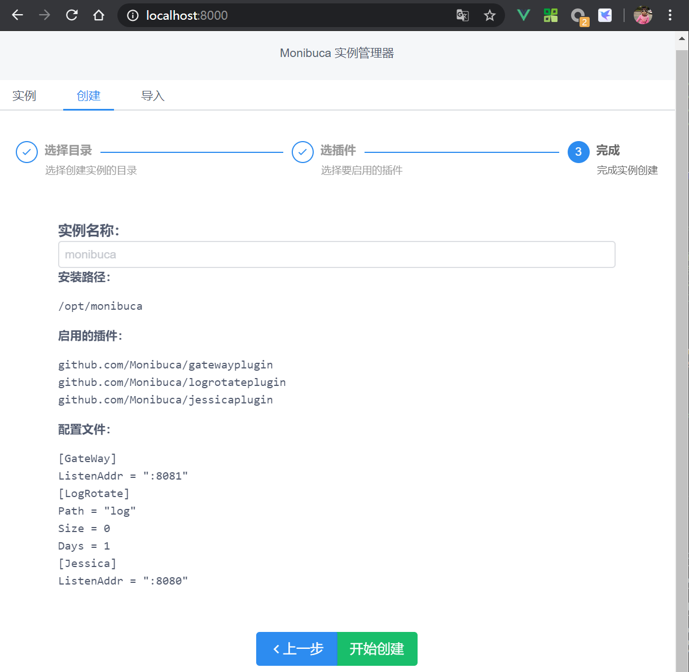
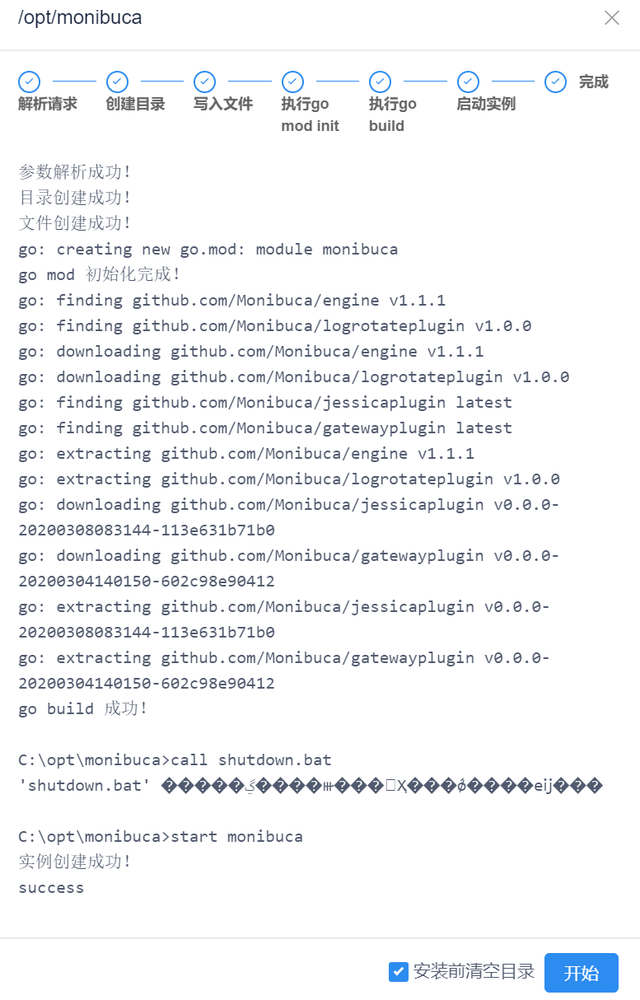

# Monibuca快速起步

## 项目地址

[https://github.com/Monibuca](https://github.com/Monibuca)

## 主页

[https://monibuca.com](https://monibuca.com)

## 介绍
Monibuca 是一个开源的流媒体服务器开发框架，适用于快速定制化开发流媒体服务器，可以对接CDN厂商，作为回源服务器，也可以自己搭建集群部署环境。
丰富的内置插件提供了流媒体服务器的常见功能，例如rtmp server、http-flv、视频录制、QoS等。除此以外还内置了后台web界面，方便观察服务器运行的状态。
也可以自己开发后台管理界面，通过api方式获取服务器的运行信息。
Monibuca 提供了可供定制化开发的插件机制，可以任意扩展其功能。

## 一键安装Golang环境并启动Demo实例

用root身份运行，确保没有权限问题
```bash
bash <(curl -s -S -L https://monibuca.com/demo.sh) 
```

## 如果Golang已经装好，确保go version >= 1.13

:::tip
如果服务器在国内无法访问golang.org等域名的情况下，需要配置GOPROXY环境变量
```bash
export GOPROXY = https://goproxy.io,direct
```
:::

```bash
go get github.com/langhuihui/monibuca
$GOPATH/bin/monibuca
```

- 然后用浏览器访问 8081端口查看管理界面。
- demo实例里面默认配置了一些插件，可供快速体验。
- 如果需要自行选择插件以及二次开发请继续往下看。

:::tip

为了方便直接运行monibuca，建议将GOPATH/bin 加入PATH的环境变量中

```bash
export PATH=$PATH:$GOPATH/bin
```
:::

## 使用实例管理器创建并启动实例

### step1 安装monica
```bash
go get github.com/Monibuca/monica
```
安装完成后会在GOPATH的bin目录下生成monica可执行文件

### step2 启动monibuca实例管理器
执行
```bash
$GOPATH/bin/monica
```
程序默认监听8000端口，你也可以带上参数指定启动的端口
```bash
$GOPATH/bin/monica -port 8001
```
### step3 创建实例
浏览器打开上面的端口地址，出现实例管理器页面，如下图：

:::tip
第一次运行实例列表中并无任何项目，这是正常的，上图中因为已经创建过实例，所以能看到实例的控制界面。
:::
点击第二个标签页“创建”,看到如下所示：

在输入框中输入你想创建实例的目录。
:::tip
实例目录要确保有写权限，因为实例管理器需要创建Go项目文件。
:::
点击下一步，进入插件选择界面：

这些插件是预先提供可以快速选择的，默认勾选了前三项。Gateway插件提供了基本的后台管理界面，可以显示其他插件的界面，建议选择。
:::tip 进阶
如果你是开发老手，也可以自行开发后台管理界面代替Gateway插件，开发过程中可以参考Gateway插件的源码来理解运行机制。
:::
你可以点击添加插件，添加更多功能：

点击选择后，会自动填入相关信息。

在这里可以填写自行开发的插件的地址，并不限于插件市场提供的插件。
:::tip 进阶
可以将自己的业务逻辑做成一个插件，这样方便复用和升级。
:::

:::warning
插件选择界面中你可以根据需要修改每一个插件的配置，当实例创建完成后，再想修改配置，则需要手工修改配置文件。
:::

点击下一步，会进入创建实例前的最后确认，此时可以对实例名称进行修改。否则使用目录名称作为实例名称。



点击开始创建后，会打印出创建时输出的内容

:::warning
创建完成后，就会立即启动实例，如果安装了Gateway插件，并使用默认的配置时，此时可以打开8081端口查看界面。
:::


:::tip
windows系统会弹出cmd窗口，linux系统会在后台运行实例。
如果由于权限等原因运行失败，可以排除掉错误后，再次点击开始，反复创建，直到成功为止。
:::

## 实例目录说明

1. main.go
2. config.toml
3. restart.sh（windows下为restart.bat)
4. fatal.log（启动后产生）

### main.go
实例启动的主文件，初始化各类插件，然后调用配置文件启动引擎
```go
package main

import (
	_ "github.com/Monibuca/clusterplugin"
	. "github.com/Monibuca/engine"
	_ "github.com/Monibuca/gatewayplugin"
	_ "github.com/Monibuca/jessicaplugin"
	_ "github.com/Monibuca/logrotateplugin"
	_ "github.com/Monibuca/rtmpplugin"
)

func main() {
	Run("config.toml")
	select {}
}
```
可以修改该主文件，添加任意功能

### config.toml

该配置文件主要是为了定制各个插件的配置，例如监听端口号等，具体还是要看各个插件的设计。

::: tip
如果你编写了自己的插件，就必须在该配置文件中写入对自己插件的配置信息
:::

如果注释掉部分插件的配置，那么该插件就不会启用，典型的配置如下：
```toml
[HDL]
ListenAddr = ":2020"
[Jessica]
ListenAddr = ":8080"
[RTMP]
ListenAddr = ":1935"
[GateWay]
ListenAddr = ":81"
#[Cluster]
#Master = "localhost:2019"
#ListenAddr = ":2019"
#
#[Auth]
#Key="www.monibuca.com"
#[RecordFlv]
#Path="./resouce"
[QoS]
Suffix = ["high","medium","low"]
```
具体配置的含义，可以参考每个插件的说明

### restart.sh
该文件是一个用来重启实例的bash脚本，方便通过实例管理器重启，或者手工重启。

### fatal.log
这个文件在程序启动后创建，程序意外退出的话，可以查看该文件里的日志信息，程序再次启动会覆盖该文件。