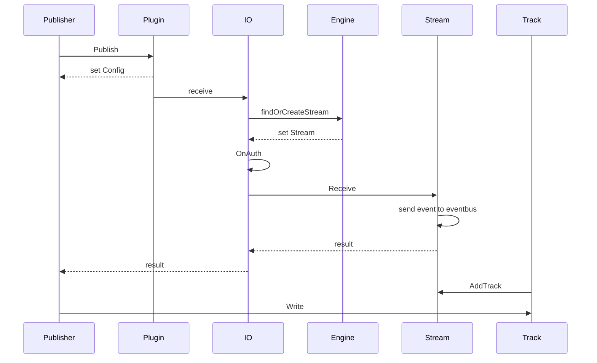
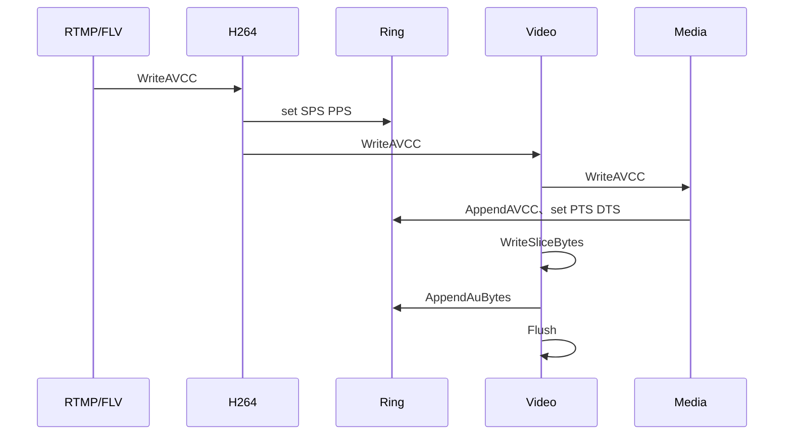
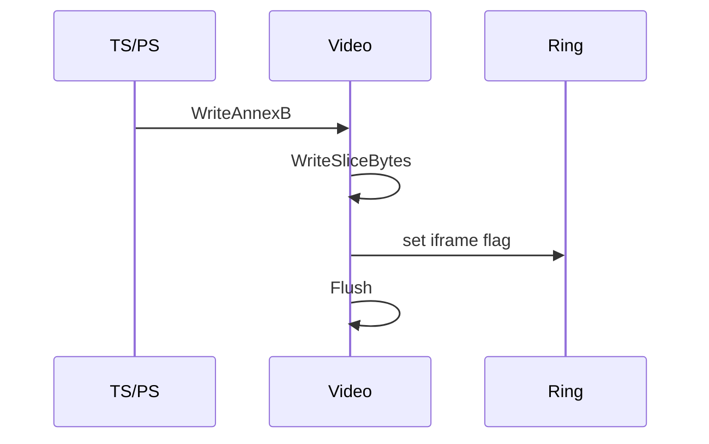
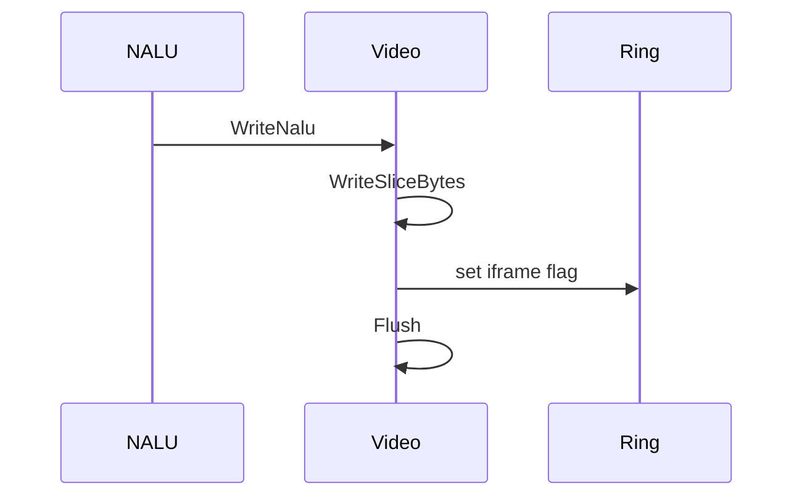
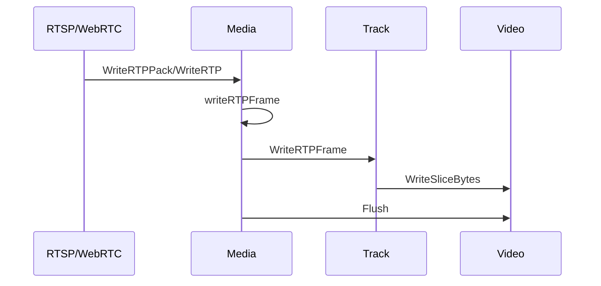
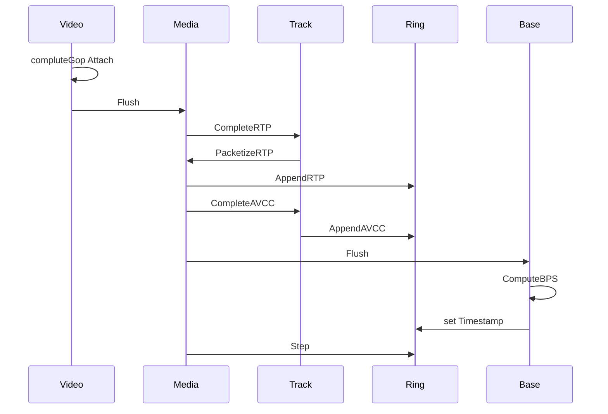
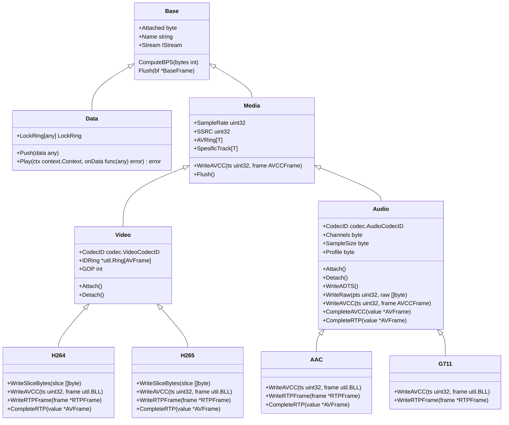

# 发布者

发布者的功能就是将音视频或者其他数据注入到 engine 中去。

视频源包括：

- 从服务端接收到的推流
- 从其他服务器拉过来的流
- 从文件中读取的数据

:::tip
可以结合官方插件中对Publisher的使用，来掌握发布者的使用方法。
:::

## 发布时序图
  


## 定义发布者

虽然可以直接使用 `Publisher` 作为发布者，但是通常我们需要自定义一个结构，里面包含 `Publisher`，这样就成为了一个特定功能的 `Publisher`。

```go
import . "m7s.live/engine/v4"

type MyPublisher struct {
  Publisher
}
```

包含 `Publisher` 后，就自动实现了 `IPublisher` 接口。
这个结构体中可以随意的放入自己需要的属性。

## 定义发布者事件回调

v4 中事件回调取代了之前的所有的逻辑，下面演示了可能接收到的事件：

```go
func (p *MyPublisher) OnEvent(event any) {
  p.Publisher.OnEvent(event)
  switch v:=event.(type) {
    case IPublisher://代表发布成功事件
    case SEclose://代表关闭事件
    case SEKick://被踢出
    case ISubscriber:
      if v.IsClosed(){
        //订阅者离开
      } else {
        //订阅者进入
      }
  }
}
```
通常IPublisher、SEclose、SEKick三个事件我们直接交给Publisher处理。内部代码如下：

```go
func (p *Publisher) OnEvent(event any) {
	switch v := event.(type) {
	case IPublisher:
		if p.Equal(v) { //第一任

		} else { // 使用前任的track，因为订阅者都挂在前任的上面
			p.AudioTrack = v.getAudioTrack()
			p.VideoTrack = v.getVideoTrack()
		}
	default:
		p.IO.OnEvent(event)
	}
}
```
## 开始发布

发布流需要先注册发布流，成功后可以对音视频轨道进行写入数据。

### 注册发布流（发布）

```go
pub := new(MyPublisher)
if plugin.Publish("live/mypub", pub) == nil {
  //注册成功
}

```
一旦注册成功就会在OnEvent收到事件。

### 创建音视频轨道

```go
import 	"m7s.live/engine/v4/track"
track.NewH264(pub.Stream)
track.NewH265(pub.Stream)
track.NewAAC(pub.Stream)
track.NewG711(pub.Stream,true) //pcma
track.NewG711(pub.Stream,false) //pcmu
track.NewDataTrack("data")//数据轨道
```
### 注册音视频轨道

音视频轨道会通过调用Attach方法自动注册到Stream中，其中视频轨道会等待收到第一个关键帧后才注册到Stream中，AAC需要等待config信息后注册，G711则是在创建时自动注册。

对于除了默认轨道外的自定义轨道，需要调用Attach方法注册到Stream中。（注意需要设置区别于默认轨道的名称防止注册失败）

### 写入轨道数据

有了轨道以后，就可以开始对轨道写入音视频数据了。下面是音视频轨道的接口，可以看到我们可以调用的方法：

```go

type Track interface {
	GetBase() *Base
	LastWriteTime() time.Time
	SnapForJson()
	SetStuff(stuff ...any)
}

type AVTrack interface {
	Track
	PreFrame() *AVFrame
	CurrentFrame() *AVFrame
	Attach()
	Detach()
	WriteAVCC(ts uint32, frame util.BLL) error //写入AVCC格式的数据
	WriteRTP([]byte)
	WriteRTPPack(*rtp.Packet)
	Flush()
	SetSpeedLimit(time.Duration)
}
type VideoTrack interface {
	AVTrack
	WriteSliceBytes(slice []byte)
	WriteAnnexB(uint32, uint32, AnnexBFrame)
	SetLostFlag()
}

type AudioTrack interface {
	AVTrack
	WriteADTS([]byte)
	WriteRaw(uint32, []byte)
}


```
对于不同的数据格式我们可以选择对应的写入方法，例如
- `rtmp`格式的数据，我们使用`WriteAVCC`来写入，时间戳为毫秒
- RTP格式数据则可以选择`WriteRTP`或者`WriteRTPPack`来写入。
- 视频支持`AnnexB`格式写入，使用WriteAnnexB来写入。时间戳为 90KHZ：毫秒数*90。
- 视频支持`WriteNalu`,写入Nalu格式的数据。
- 音频支持`WriteADTS`来写入`ADTS`头信息。
- 其他数据我们可以先获取到裸数据然后调用`WriteSliceBytes`来写入。

`WriteAVCC` 的内部流程：


`WriteAnnexB` 的内部流程：

`WriteNalu` 的内部流程：


`WriteRTP`以及`WriteRTPPack`的内部流程：


Video.Flush 后半段的内部流程：（Track代表具体Track）


Track 数据结构：（go里面没有继承，所有用组合的方式来实现）


## 停止发布

```go
pub.Stop()
```
