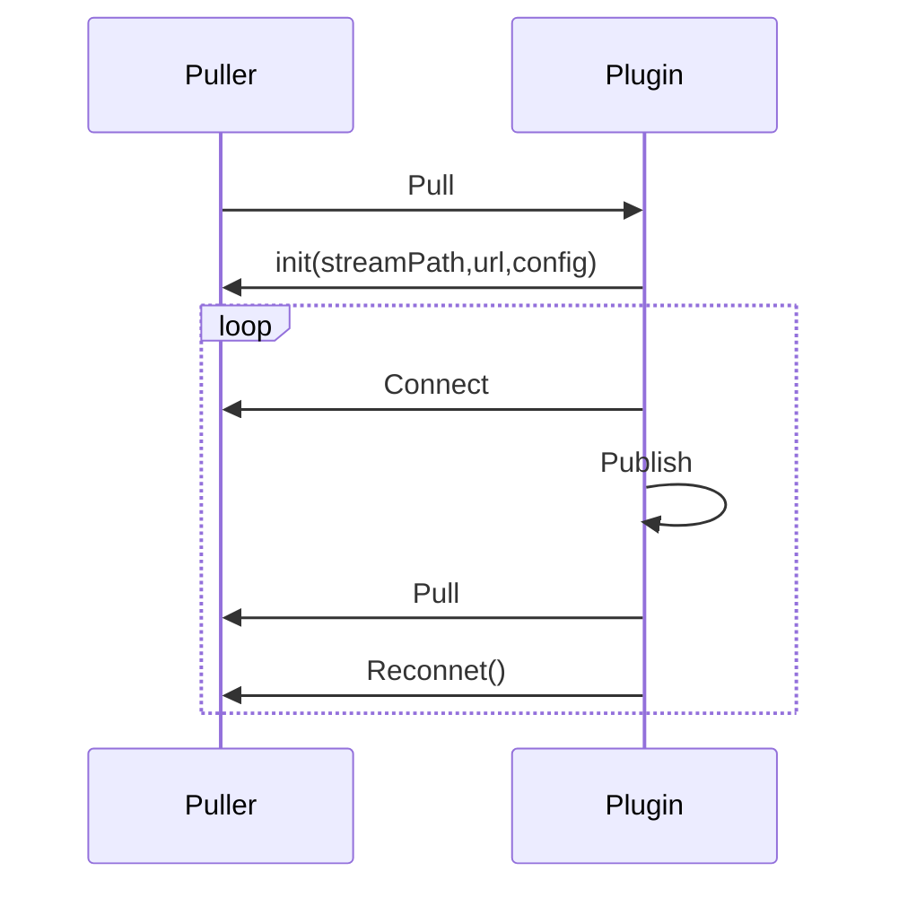

# 拉流者Puller

这里的拉流者指的是从远程拉流的功能。

:::tip
可以结合官方插件中对Puller的使用，来掌握拉流者的使用方法。包含Puller功能的插件有rtmp、rtsp、hls、hdl
:::

## 拉流时序图
  

## 自定义拉流者

通常拉流者需要将拉过来的流发布到engine中，所以都会同时包含Publisher

```go
import . "m7s.live/engine/v4"
type MyPuller struct {
  Publisher
  Puller
}
```

包含 `Puller` 后，并不会自动实现了 `IPuller` 接口。所以需要自己实现 `IPuller` 接口。
这个结构体中可以随意的放入自己需要的属性。

## 实现IPuller接口
第一个需要实现的接口就是连接事件回调，在这个回调里面需要去连接远程服务器。

```go
func (puller *MyPuller) Connect() (err error) {
  //连接远程服务器
}
```
第二个需要实现的接口就是拉流事件回调，在这个回调里面需要去拉流。

```go
func (puller *MyPuller) Pull() error {
  //拉流，将数据填入Publisher的Track中
}
```
如果连接失败则不会自动发布流，否则会自动发布流，然后调用 `Pull` 方法。

## 启动拉流

通常包含拉流功能的插件都会提供自动拉流功能，可以看到在插件启动的时候会调用下面的方法。

此外也有按需拉流，和调用API后拉流的功能，调用方式也是一样。

```go
plugin.Pull(streamPath, url, new(MyPuller), 0)
```
如果需要则特定的条件下拉流，可以以上面的以编程方式调用开始拉流。

## 断线重连

默认支持断线重连功能，即在远程连接断开的时候会再次调用`Connect`和`Pull`。配置文件后可配置重连次数等。
