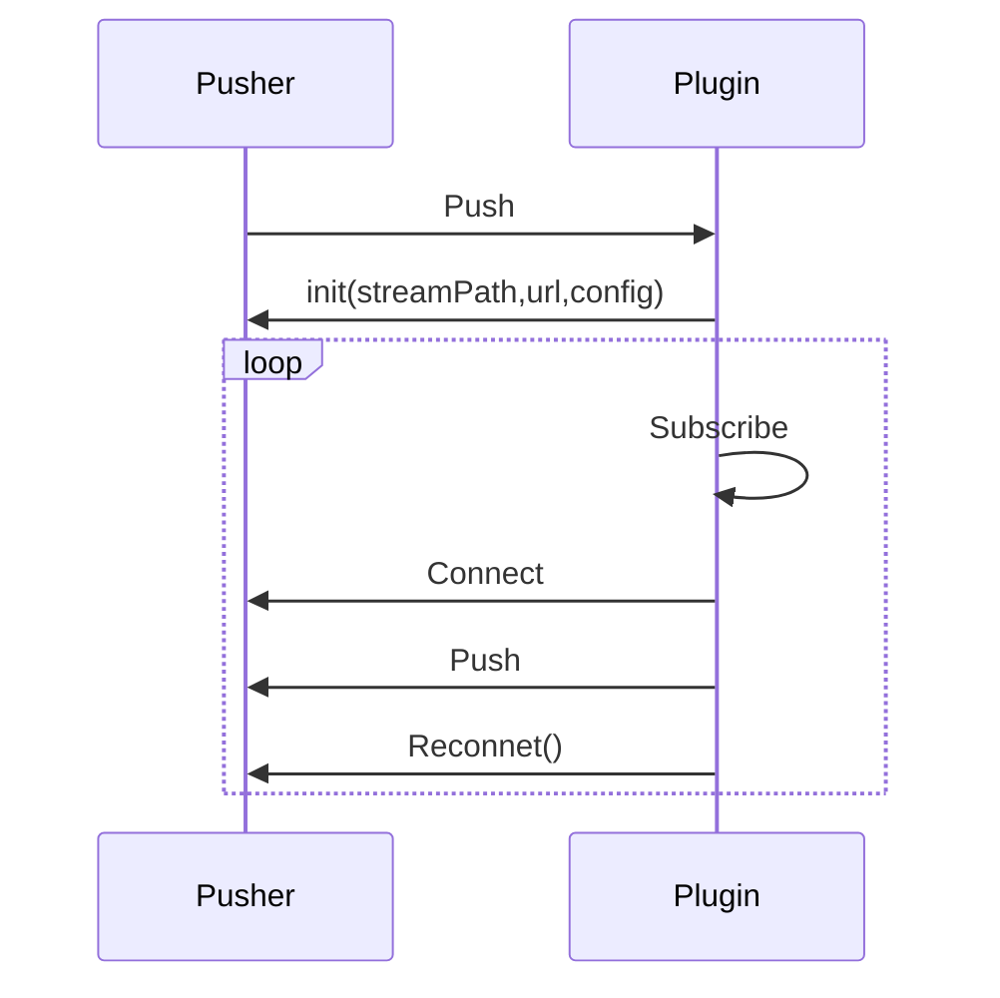

# 推流者Pusher

这里的推流者指的是从远程推流的功能。

:::tip
可以结合官方插件中对Pusher的使用，来掌握推流者的使用方法。包含Pusher功能的插件有rtmp、rtsp
:::

## 推流时序图
  


## 自定义推流者

通常推流者需要将engine中的流订阅出来后推出去，所以都会同时包含Subscriber

```go
import . "m7s.live/engine/v4"
type MyPusher struct {
  Subscriber
  Pusher
}
```

包含 `Pusher` 后，并不会自动实现了 `IPusher` 接口。所以需要自己实现 `IPusher` 接口。
这个结构体中可以随意的放入自己需要的属性。

## 实现IPusher接口
第一个需要实现的接口就是连接事件回调，在这个回调里面需要去连接远程服务器。

```go
func (Pusher *MyPusher) Connect() (err error) {
  //连接远程服务器
}
```
第二个需要实现的接口就是推流事件回调，在这个回调里面需要去推流。

```go
func (Pusher *MyPusher) Push() error {
  // 将数据推送到远程服务器
}
```
如果连接失败则不会自动订阅流，否则会自动订阅流，然后调用 `Push` 方法。

## 启动推流

可以配置按需推流，和调用API后推流的功能，调用方式也是一样。

```go
plugin.Push(streamPath, url, new(MyPusher), false)
```
如果需要则特定的条件下推流，可以以上面的以编程方式调用开始推流。

## 断线重连

默认支持断线重连功能，即在远程连接断开的时候会再次调用`Connect`和`Push`。配置文件后可配置重连次数等。
