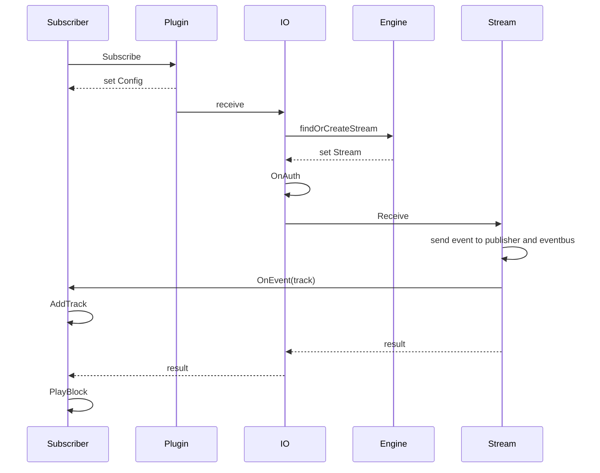

# 订阅者

订阅者的功能就是将音视频或者其他数据从 engine 中读取出来。

读取出来后，通常会发送给播放器，或者写入磁盘。

:::tip
可以结合官方插件中对Subscriber的使用，来掌握订阅者的使用方法。
:::

## 订阅时序图
  


## 定义订阅者

虽然可以直接使用 `Subscriber` 作为订阅者，但是通常我们需要自定义一个结构，里面包含 `Subscriber`，这样就成为了一个特定功能的 `Subscriber`。

```go
import . "m7s.live/engine/v4"

type MySubscriber struct {
  Subscriber
}
```
包含 `Subscriber` 后，就自动实现了 `ISubscriber` 接口。
这个结构体中可以随意的放入自己需要的属性。


## 定义订阅者事件回调

v4 中事件回调取代了之前的所有的逻辑，下面演示了可能接收到的事件：

```go
import (
  . "m7s.live/engine/v4"
  "m7s.live/engine/v4/track"
  "m7s.live/engine/v4/common"
)
func (p *MySubscriber) OnEvent(event any) {
  switch v:=event.(type) {
    case ISubscriber://代表订阅成功事件，v就是p
    case SEclose://代表关闭事件
    case common.Track: //代表收到Track事件(包括所有的Track事件),响应了这个就屏蔽了下面三个
    case *track.Audio: //代表收到AudioTrack事件
    case *track.Video: //代表收到VideoTrack事件
    case *track.Data: //代表收到DataTrack事件
    case AudioDeConf: //代表收到Audio 的序列头事件
    case VideoDeConf: //代表收到Video 的序列头事件
    case common.ParamaterSets: //代表收到Video 的VPS、SPS、PPS事件
    case AudioFrame: //代表收到AudioFrame事件，使用raw订阅时会收到
    case VideoFrame: //代表收到VideoFrame事件，使用raw订阅时会收到
    case FLVFrame: //代表收到含有FLV数据的帧事件,使用flv订阅时会收到
    case VideoRTP: //收到了视频RTP包，使用rtp订阅时会收到
    case AudioRTP: //收到了音频RTP包，使用rtp订阅时会收到
    default:
      p.Subscriber.OnEvent(event)
  }
}
```
其中收到`Track`或者`*track.Audio`、`*track.Video`、`*track.Data` 后需要判断是否接收这个Track，即调用
`p.AddTrack(v)`

通常我们如果需要全盘接收的话，可以不响应这些类型的事件，而交给 `Subscriber` 的 `OnEvent` 去处理(即从上方的default进入)。内部代码如下

```go
func (s *Subscriber) OnEvent(event any) {
	switch v := event.(type) {
	case Track: //默认接受所有track
		s.AddTrack(v)
	default:
		s.IO.OnEvent(event)
	}
}
```

## 开始订阅

订阅流需要先注册订阅流，成功后可以对音视频轨道进行读取操作。

### 注册订阅流（订阅）

该函数会阻塞一小段时间，直到注册成功或者失败。
```go
sub := new(MySubscriber)
if plugin.Subscribe("live/test", sub) == nil {
  //注册成功
}
```
一旦注册成功就会在OnEvent收到事件。

### 开始读取
可以任选以下三种方式读取音视频数据，不同的读取方式收到的事件也不同的
```go
func (s *Subscriber) PlayRaw() {
	s.PlayBlock(SUBTYPE_RAW)
}

func (s *Subscriber) PlayFLV() {
	s.PlayBlock(SUBTYPE_FLV)
}

func (s *Subscriber) PlayRTP() {
	s.PlayBlock(SUBTYPE_RTP)
}
```

如果没有其他逻辑要分离处理也可以直接调用下面这个方法
```go
func (opt *Plugin) SubscribeBlock(streamPath string, sub ISubscriber, t byte) (err error) {
	if err = opt.Subscribe(streamPath, sub); err == nil {
		sub.PlayBlock(t)
	}
	return
}
```
从字面上就看出是阻塞读取数据。
读取到的数据我们从OnEvent中去处理。
如果订阅完成或者中途退出了，那么这个阻塞就会释放。


## 停止订阅

```go
sub.Stop()
```

## 资源跟随关闭

如果订阅者和某个可关闭的资源(例如conn)是强绑定关系，则可以调用
```go
sub.SetIO(conn)
```
那么当这个sub被关闭的时候，也会调用conn的Close方法。
注意：主动停止订阅即，调用sub.Stop不会调用conn的Close方法。

## 给订阅者加父级Context

有时候我们需要订阅者跟随某个Context而关闭则可以调用

```go
sub.SetParent(ctx)
```
