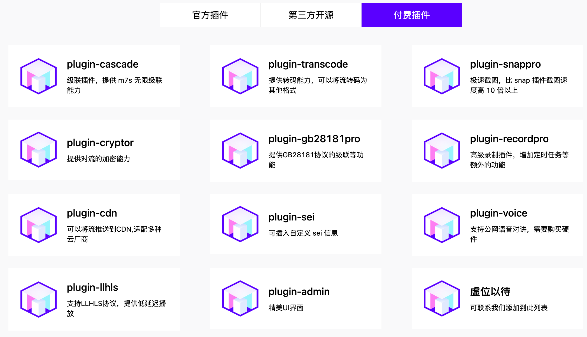

# 社区版和pro版区别

pro版本分为 专业版、商业版 和 企业版，具体区别如下：

| 功能特性 | 社区版 | 专业版 | 商业版 | 企业版 |
|---------|--------|--------|--------|--------|
| 开源插件 | ✓ | ✓ | ✓ | ✓ |
| 闭源插件 | | ✓ | ✓ | ✓ |
| Admin管理后台 | | | ✓ | ✓ |
| 插件源码 | | | | ✓ |
| 技术支持 | | 面议 | 面议 | 面议 |
| 费用 | 免费 | 面议 | 面议 | 面议 |
| 集成支持 | | 面议 | 面议 | 面议 |
| 定制开发 | | 面议 | 面议 | 面议 |

## 版本说明

### 社区版
- 完全免费开源
- 支持所有开源插件
- 社区支持

### 专业版
- 包含所有开源插件
- 支持闭源商业插件
闭源插件如下图所示：

- 7天技术支持
- 可选集成支持和定制开发服务

### 商业版
- 包含专业版所有功能
- Admin管理后台
如下图所示：

- 1个月技术支持
- 可选集成支持和定制开发服务

### 企业版
- 包含商业版所有功能
- Console控制台
- 插件源码授权
- 长期技术支持
- 包含集成支持和定制开发

## 联系方式

- 微信：yigehui