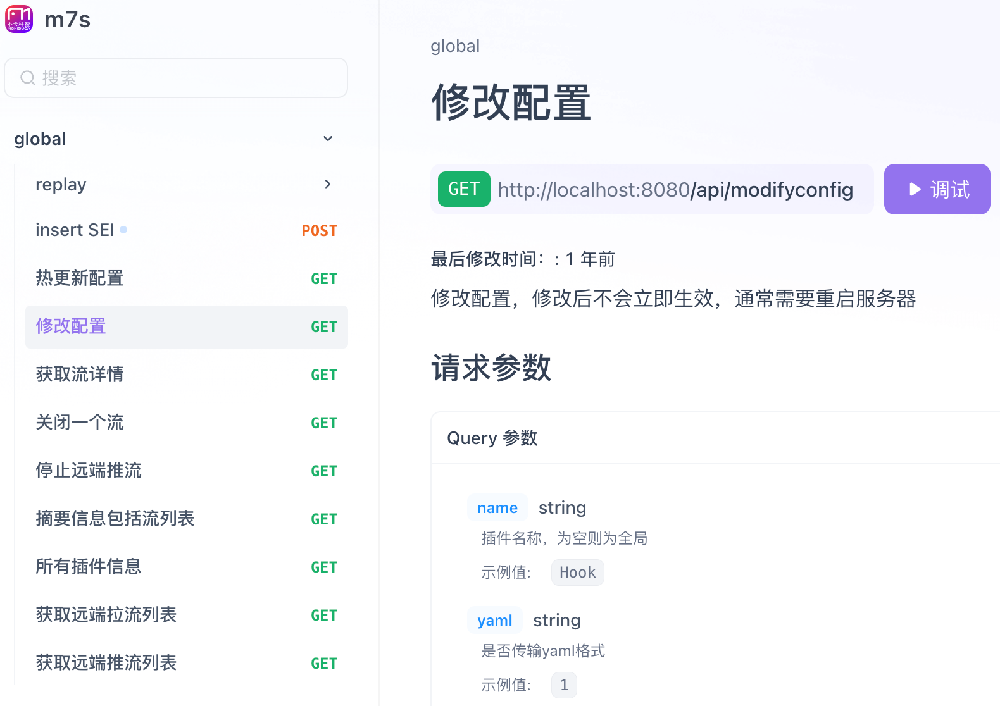

# API

Monibuca 提供 HTTP 形式的 API 调用，方便用户对 Monibuca 实例进行信息的读取和指令下达。

Monibuca API 分为系统 API 和 插件 API 。

## 系统 API

系统 api 在 apifox 上维护，如下图所示：

<!--  -->

点击链接查看：https://apifox.com/apidoc/shared-53418b09-8f45-49e5-94e3-1b93870b304f

## 插件 API

请参考各插件说明文档

- rtmp 插件 API [/guide/plugins/rtmp.html#接口-api](/guide/plugins/rtmp.html#接口-api)
- rtsp 插件 API [/guide/plugins/rtmp.html#接口-api](/guide/plugins/rtsp.html#接口-api)
- hdl 插件 API [/guide/plugins/hdl.html#接口-api](/guide/plugins/hdl.html#接口-api)
- hls 插件 API [/guide/plugins/hls.html#接口-api](/guide/plugins/hls.html#接口-api)
- gb28181 插件 API [/guide/plugins/gb28181.html#接口-api](/guide/plugins/gb28181.html#接口-api)
- ps 插件 API [/guide/plugins/ps.html#接口-api](/guide/plugins/ps.html#接口-api)
- webrtc 插件 API [/guide/plugins/webrtc.html#接口-api](/guide/plugins/webrtc.html#接口-api)
- webtransport 插件 API [/guide/plugins/webtransport.html#接口-api](/guide/plugins/webtransport.html#接口-api)
- record 插件 API [/guide/plugins/record.html#接口-api](/guide/plugins/record.html#接口-api)
- debug 插件 API [/guide/plugins/debug.html#接口-api](/guide/plugins/debug.html#接口-api)
- logrotate 插件 API [/guide/plugins/logrotate.html#接口-api](/guide/plugins/logrotate.html#接口-api)
- preview 插件 API [/guide/plugins/preview.html#接口-api](/guide/plugins/preview.html#接口-api)
- snap 插件 API [/guide/plugins/snap.html#接口-api](/guide/plugins/snap.html#接口-api)
- snap 插件 API [/guide/plugins/snap.html#接口-api](/guide/plugins/snap.html#接口-api)
- exporter 插件 API [/guide/plugins/exporter.html#接口-api](/guide/plugins/exporter.html#接口-api)
- monitor 插件 API [/guide/plugins/monitor.html#接口-api](/guide/plugins/monitor.html#接口-api)
