# 介绍

:::tip 您正在阅读的是m7s v4的文档
- m7s v3 文档需要自行访问[https://github.com/langhuihui/m7s-docs](https://github.com/langhuihui/m7s-docs) 的v3分支
- [v4升级的功能](./v4)
:::

## 什么是Monibuca（m7s)？

Monibuca(发音：模拟不卡，m7s是其缩写，类似k8s) 是一个开源的Go语言开发的流媒体服务器开发框架。
它基于go1.19+，此外并无任何其他依赖构建，并提供了一套插件式的二次开发模型，帮助你高效地开发流媒体服务器，你既可以直接使用官方提供的插件，也可以自己开发插件扩展任意的功能，所以Monibuca是可以支持**任意**流媒体协议的框架！

:::tip 如果您需要二次开发
- 请访问[开发文档](../devel/startup)
- 建议先熟悉使用文档后再进行二次开发
:::

> 流媒体服务器是一种用于分发流媒体的服务器端软件，可用于直播、监控、会议等需要实时观看音视频的场景。流媒体服务器区别于传统Web服务器对于实时性要求极高，需要使用各种传输协议，而Web服务器则主要以http/https协议为主。

Monibuca由三部分组成：引擎、插件、实例工程。
- 引擎提供一套通用的流媒体数据缓存以及转发的机制，本身不关心协议如何实现
- 插件提供其他所有的功能，并可以无限扩展
- 实例工程是引入引擎和插件并启动引擎的项目工程，可以完全自己编写

## 插件式框架

Monibuca旨在构建一个通用的流媒体开发生态，所以从v1版本开始就考虑到业务和流转发的解耦，从而设计了一套可供任意扩展的插件机制。根据你的需求场景，可以灵活引入不同类型的插件：
- 提供流媒体协议打包/解包，例如rtmp插件、rtsp插件等
- 提供日志持久化的处理——logrotate插件
- 提供录像功能——record插件
- 提供丰富的调试功能——debug插件
- 提供http回调能力——hook插件

如果你是有经验的开发者，那么最佳的方式是在现有的插件基础上进行二次开发，并可向更多的人提供可重用的插件丰富生态。
如果你是流媒体的初学者，那么最佳的方式是利用现有的插件拼凑出你需要的功能，并向有经验的开发者寻求帮助。

## 常见业务场景
中转流服务器、视频客服、巡检（无人机、机房、码头、铁路、厂区）、停车场收费、设备报警回放、视频会议、直播间、语聊房、在线教育

```mermaid
flowchart TD
    subgraph 直播
        ffmpeg-->RTMP
        obs-->RTMP-->E0((eneing))
        E0-->any0(HDL/HLS/Jessica/WebRTC)
    end
    subgraph 设备监控
        d[设备]-->GB(GB28181)-->E((engine))
        d-->RTSP(RTSP)-->E
        E-->any(HDL/HLS/Jessica/WebRTC)
    end
    subgraph 监控录制
        d2[设备]-->GB2(GB28181)-->E1((engine))
        d2-->RTSP2(RTSP)-->E1
        E1-->Record
    end
    subgraph 直播转发
        远端HLS流-->H2(HLS)-->E2((engine))-->H3(HLS)
        远端FLV流-->HDL0(HDL)-->E5((engine))-->HDL1(HDL)
    end
    subgraph 多人视频
        Web-->RTC1(WebRTC)-->E3((engine))-->RTC2(WebRTC)
        Web-->Room(Room)-->E3
    end
    subgraph 录像转直播
        flv-->HDL2(HDL)-->E4((engine))
        mp4-->|api| E4
        m3u8-->H4(HLS)-->E4
        E4-->any1(HDL/HLS/Jessica/WebRTC)
    end
```

## 主要功能

### 引擎方面
- 提供插件机制，对插件的启动，配置解析，事件派发等进行统一管理
- 提供H264、H265、AAC、G711格式的转发
- 提供可复用的AVCC格式、RTP格式、AnnexB格式、ADTS格式等预封装机制
- 提供多Track机制，支持大小流，加密流扩展
- 提供DataTrack机制，可用于实现房间文字聊天等功能
- 提供时间戳同步机制，限速机制
- 提供RTP包乱序重排机制
- 提供订阅者追帧跳帧机制（首屏秒开）
- 提供发布订阅对外推拉的基础架构
- 提供鉴权机制的底层架构支持
- 提供内存复用机制
- 提供发布者断线重连机制
- 提供按需拉流机制
- 提供HTTP服务端口公用机制
- 提供HTTP API接口自动注册机制
- 提供HTTP接口中间件机制
- 提供结构化日志
- 提供流信息统计和输出
- 提供事件总线机制，可以对所有插件广播事件
- 提供配置热更新机制

### 插件方面

- 提供RTMP协议的推拉流，对外推拉流（支持RTMPS）
- 提供RTSP协议的推拉流，对外推拉流
- 提供HTTP-FLV协议的拉流，对外拉流，读取本地FLV文件
- 提供WebSocket协议的拉流
- 提供HLS协议的拉流，对外拉流
- 提供WebRTC协议的推拉流
- 提供GB28181协议的推流,提供dump回放分析能力
- 提供Onif协议的支持
- 提供WebTransport协议的拉流
- 提供fmp4协议的拉流
- 提供边缘服务器功能，实现级联拉流
- 提供录像功能，支持flv、mp4、hls、raw格式
- 提供日志持久化功能，支持按天、按小时、按分钟、按秒、按大小、按文件数等多种方式
- 提供截屏功能
- 提供HTTP回调功能
- 提供预览功能（集成Jessibuca Pro）
- 提供房间功能（可实现视频会议）
- 提供对接Prometheus的功能

第三方插件和收费插件提供更多额外功能，不在此罗列。
### 远程控制台
- 提供多实例管理功能
- 提供流详情显示
- 提供配置可视化编辑
- 提供日志可视化显示
- 提供插件可视化管理
- 提供GB设备管理
- 提供动态添加远程推拉流界面
- 提供WebRTC背景墙功能
- 提供多人视频演示

## 名称的由来
Monibuca这个单词来源于 `Monica` （莫妮卡），为了解决起名的难题，使用了三个名称分别是 `Monica` 、 `Jessica` 、`Rebecca` 用来代表服务器、播放器、推流器。由于莫妮卡、杰西卡、瑞贝卡，都带卡字，对直播来说寓意不好，所以改为莫妮不卡（`Monibuca`）、杰西不卡[Jessibuca](https://jessibuca.com)、瑞贝不卡[Monibuca](https://Monibuca.com)。