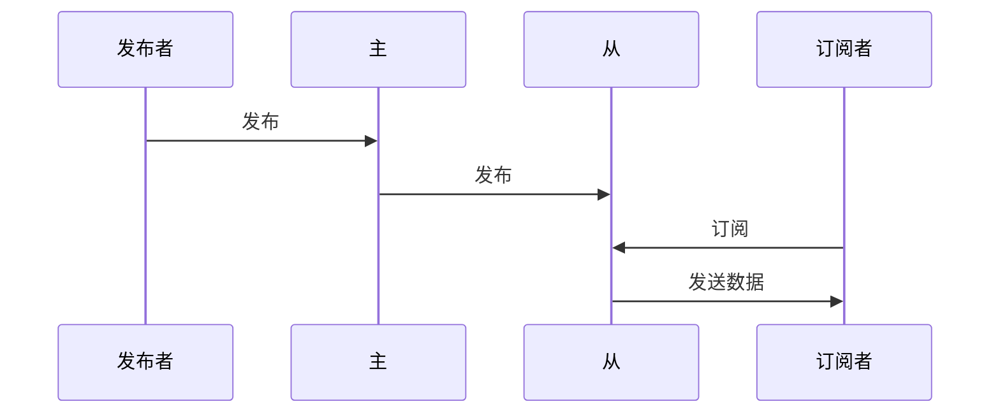
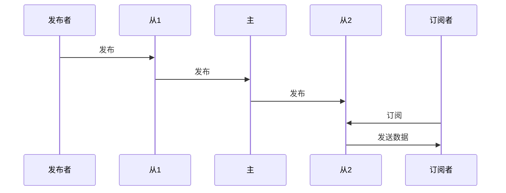

# 集群插件

该插件可以实现m7s和m7s之间进行级联转发功能，扩展系统承载能力，服务器之间采用QUIC协议互相通讯，保证了低延迟

## 插件地址

github.com/Monibuca/plugin-cluster

## 插件引入
```go
import (
    _ "github.com/Monibuca/plugin-cluster"
)
```

## 默认插件配置
```toml
[Cluster]
# ListenAddr = ":2019"
# OriginServer = "192.168.1.120:2019"
```
- `OriginServer` 源服务器——上级服务器
- `ListenAddr` 作为源服务器，监听来自下一级服务器的连接

可以同时指定两个，使得该服务器成为中转站

## 通讯机制

### 主服务器发布，从服务器播放


### 从服务器发布

