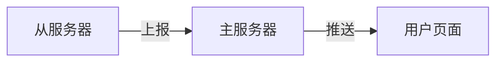

# Summary插件

对系统的信息进行采样，支持级联采样，即从服务器会向主服务器报告数据

> 如果没有订阅者则不进行采集，节省系统资源

## 默认配置

```toml
[Summary]
SampleRate = 1
```
- SampleRate 采样率，单位秒，即每一秒采样一次

## 数据结构

```go
type ServerSummary struct {
	Address string
	Memory  struct {
		Total uint64
		Free  uint64
		Used  uint64
		Usage float64
	}
	CPUUsage float64
	HardDisk struct {
		Total uint64
		Free  uint64
		Used  uint64
		Usage float64
	}
	NetWork     []NetWorkInfo
	Streams     []*Stream
	lastNetWork []NetWorkInfo
	ref         int
	control     chan bool
	reportChan  chan *ServerSummary
	Children    map[string]*ServerSummary
}
```


## API

- `/api/summary` 获取采样数据，这个接口返回一个SSE

## 上报逻辑

