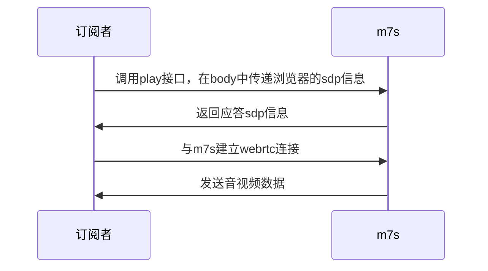
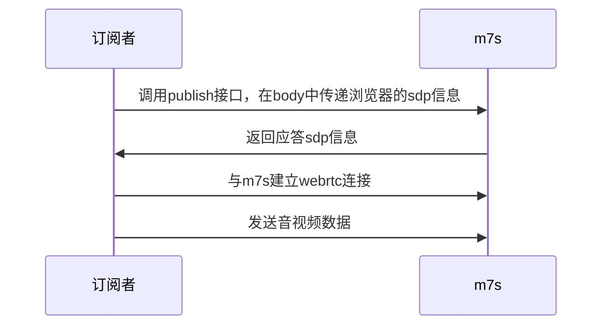

# WebRTC 插件

提供通过网页发布视频到m7s，以及从m7s拉流通过webrtc进行播放的功能

## 插件地址

github.com/Monibuca/plugin-webrtc

## 插件引入
```go
import (
    _ "github.com/Monibuca/plugin-webrtc"
)
```

## 默认插件配置

```toml
[WebRTC]
# 端口范围不配置的话是自动分配
# PortMin = 30000
# PortMax = 40000
# 如果需要公网访问，需要配置公网IP，本机测试不需要配置
PublicIP = ["127.0.0.1"]
```

## API
- `/api/webrtc/play?streamPath=live/rtc`
用于播放live/rtc的流，需要在请求的body中放入sdp的json数据，这个接口会返回服务端的sdp数据
- `/api/webrtc/publish?streamPath=live/rtc`
同上


## 基本原理

通过浏览器和m7s交换sdp信息，然后读取rtp包或者发送rtp的方式进行

### 播放WebRTC流



### 发布WebRTC流


