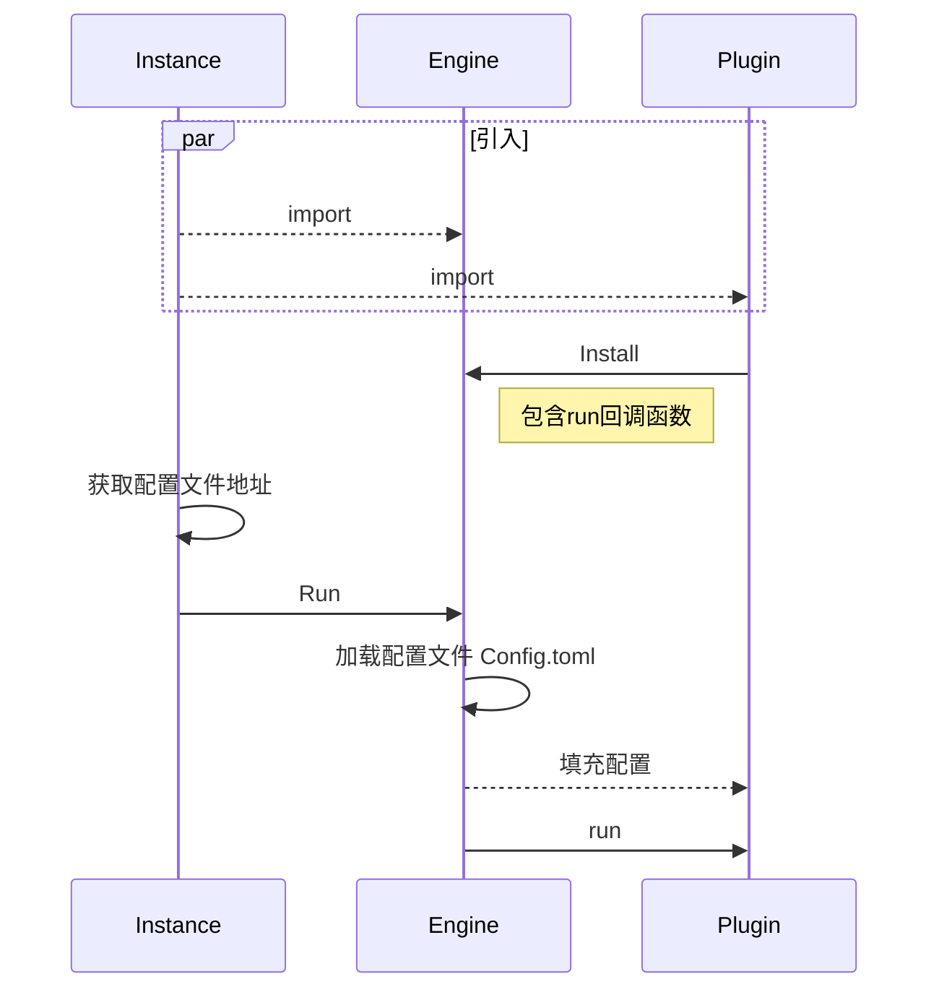
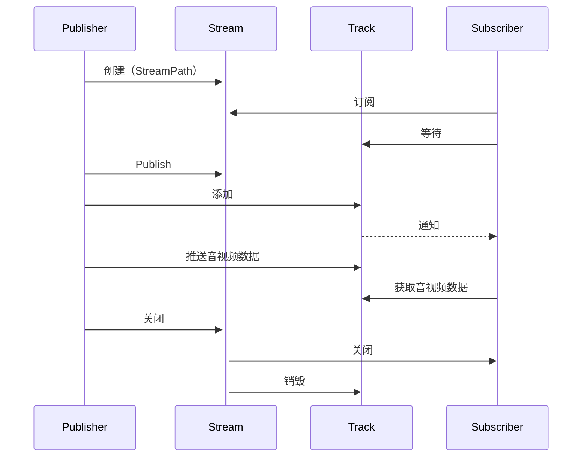
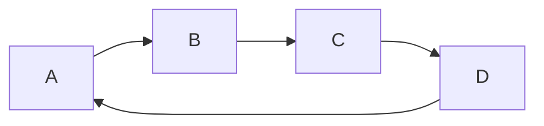
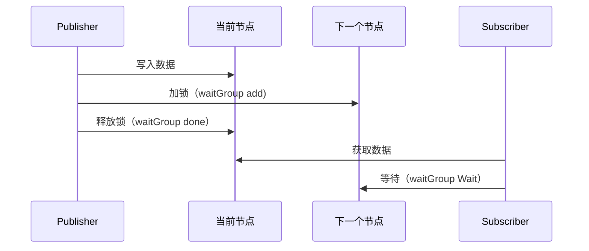
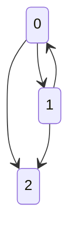
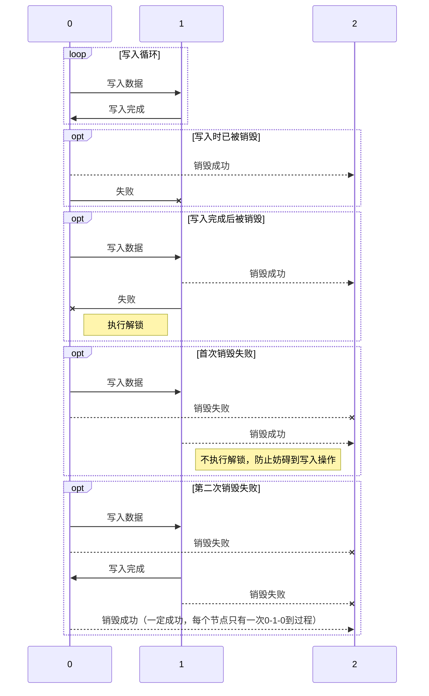
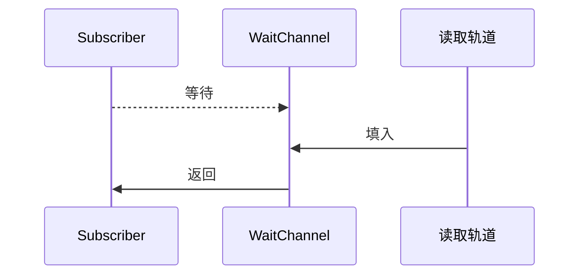
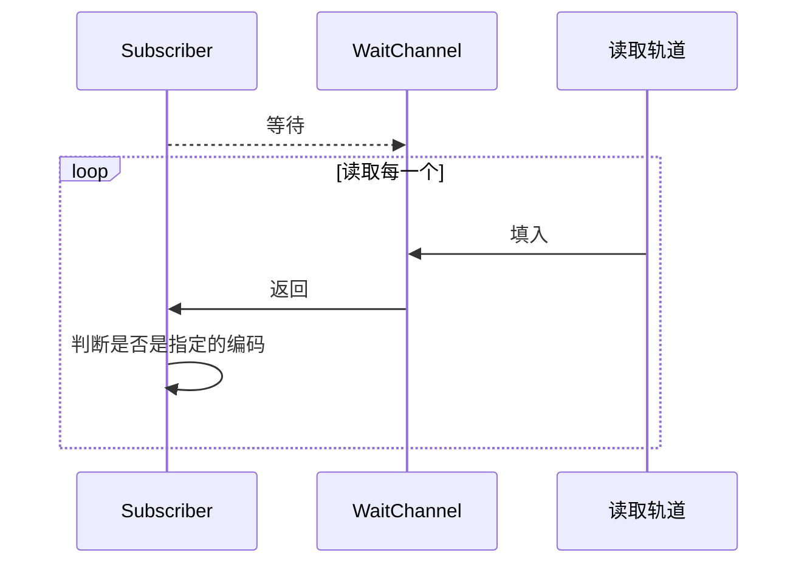
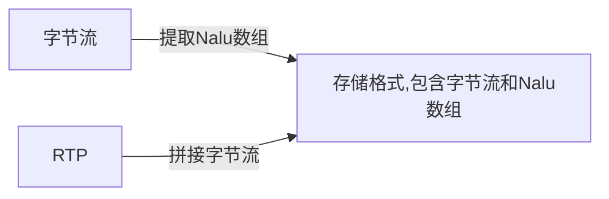

# 设计架构

## 插件启动



## 流转发



## 缓冲环



## 缓冲读写


## 缓冲环的销毁

::: TIP
当发布者关闭后，需要将所有的缓冲环的当前锁定的节点解锁，防止订阅者无限等待
:::

通过原子操作避免使用锁，因为销毁操作和写入操作可能不在同一个goroutine中
- 在写入操作时，尝试从0改成1，如果成功那么说明写入成功，否则说明已被销毁（已变为2）
- 在写完以后，尝试从1改变成0，如果失败，说明已经变为2了，需要解锁
```go
func (r *RingDisposable) Write(value interface{}) {
	// r.UpdateTime = time.Now()
	last := r.Current()
	last.Value = value
	if atomic.CompareAndSwapInt32(&r.Flag, 0, 1) {
		current := r.GetNext()
		current.Add(1)
		last.Done()
		//Flag不为1代表被Dispose了，但尚未处理Done
		if !atomic.CompareAndSwapInt32(&r.Flag, 1, 0) {
			current.Done()
		}
	}
}
```
- 在销毁时,尝试从0改成2，如果成功，就解锁，如果失败说明此时为1，尝试从1改成2，如果失败，说明此时为0，则尝试从0改成2
```go
func (r *RingDisposable) Dispose() {
	current := r.Current()
	if atomic.CompareAndSwapInt32(&r.Flag, 0, 2) {
		current.Done()
	} else if atomic.CompareAndSwapInt32(&r.Flag, 1, 2) {
		//当前是1代表正在写入，此时变成2，但是Done的任务得交给NextW来处理
	} else if atomic.CompareAndSwapInt32(&r.Flag, 0, 2) {
		current.Done()
	}
}
```



## 等待指定媒体轨道

在流创建后5秒内为等待区间，超过5秒后不再等待，直接判断是否存在音视频轨

### 直接返回轨道
```go
ts.RLock()
defer ts.RUnlock()
if len(codecs) == 0 {
    return ts.m[ring.Read().(string)]
} else {
    for _, codec := range codecs {
        if t, ok := ts.m[codec]; ok {
            return t
        }
    }
    return nil
}
```

### 任意编码轨道



### 指定编码轨道


## 不同视频包装格式存储
字节流格式：即RTMP协议所用的格式：
VideoTagHeader + Nalu长度 + Nalu
